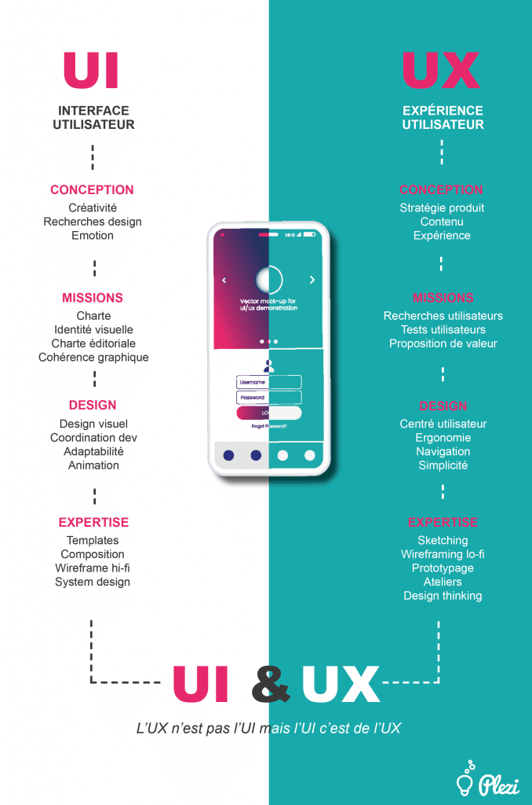

# UX/UI

- UX design : User eXperience / “expérience utilisateur”
- UI Design : User Interface / “interface utilisateur”

## UX Design

L’UX ou expérience utilisateur désigne la manière dont votre site est perçu par les internautes selon des critères d’ergonomie, de navigation et de contenu. Il s’agit du ressenti émotionnel de l’utilisateur face à votre interface web ; à ne pas confondre avec l'UI Design.

Ici on trouvera le ressenti général, la simplicité (ou la non-simplicité) d'utilisation. L'UX Design sert à améliorer/optimiser l’interaction d’un utilisateur avec un produit.

## UI Design

L’UI ou interface utilisateur qui relève de l’organisation des éléments graphique et textuels. Bien que faisant partie de l’UX, l’UI ne traite que des apparences, du ‘packaging’ de votre site ou application.

Ici on va parler de charte graphique, de couleurs, de polices de caractère…

## Les 6 critères d’une expérience utilisateur optimale

1. **_Utilité_** Une sélection stratégique des informations et des fonctionnalités nécessaires au site internet
2. **_Utilisabilité_** Une navigation ergonomique et intuitive
3. **_Adaptabilité_** Un design responsive qui s’adapte aux différents supports technologiques de consultation
4. **_Accessibilité_** Un positionnement optimal sur les moteurs de recherche grâce à un travail de référencement fait en amont
5. **_Crédibilité_** Un aspect et une organisation qui correspondent à l’image de marque et qui inspirent la confiance des internautes
6. **_Efficacité_** Des informations structurées et faciles à trouver

## Conclusion

UX et UI sont donc des concepts interconnectés qui doivent être inclus dans le processus de création des agences web notamment.

[Quelques chiffres](http://blog.marginmedia.com.au/Our-Blog/bid/87385/10-Mobile-Web-Design-Statistics-All-Marketers-Should-Know-About)

[En savoir plus](https://www.docaposte.com/blog/paroles-experts/ux-ui-design-une-priorite/)

[WebDesign](https://www.lafabriquedunet.fr/thematique/web-design/)

[Charte graphique](https://lagrandeourse.design/blog/comment-reussir-une-charte-graphique/)

[UI Design : Dribble](https://dribbble.com/)
