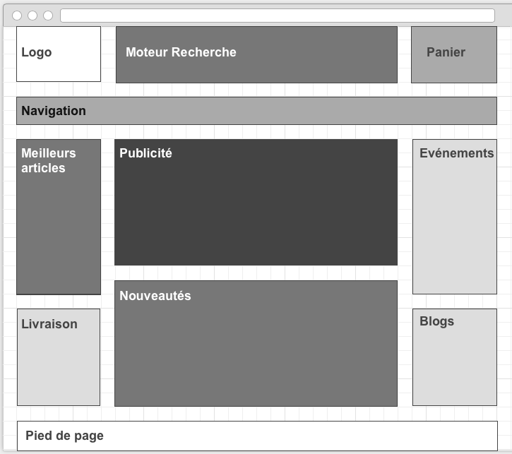
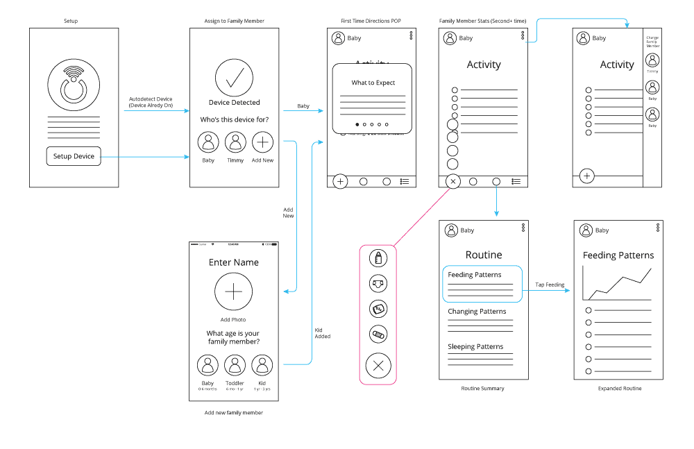

# Wireframe

## Définition

Le wireframe est une maquette sans couche graphique (le squelette / la structure) d’une interface utilisateur.

Le wireframe sert à constituer une vision globale sur l’architecture d’une interface, y compris les éléments à mettre en place (images, textes, vidéos), leur l’emplacement et le contenu à placer dans chaque zone.

À partir d'un wireframe, un graphiste peut réaliser l'interface complète.

Le wireframe consiste concrètement en un croquis. Il peut être générique, en noir et blanc.

C'est le schéma réalisé afin de définir les contours d’une interface digitale utilisateur ainsi que les onglets qu’elle contiendra.

### Zoning

### Vue d'ensemble de l'application mobile

## Description

Pour chaque type de page ou d'écran, le concepteur identifie les différentes zones de la page qu’il schématise à l’aide de blocs ou de boîtes afin de déterminer les grandes fonctionnalités et les zones principales du contenu.

Le wireframe peut servir de support de discussion avec les commanditaires du site web.

## Exemples

[I ♥ wireframes](https://wireframes.tumblr.com/)

## Transformer une page en Wireframe

[Extension wirify](https://www.wirify.com/)

## FIGMA

## Sources

- Wikipedia
- [Le guide du débutant](https://webdesign.tutsplus.com/fr/articles/a-beginners-guide-to-wireframing--webdesign-7399)
- [Wireframe, Zoning… conseils](https://www.matthieu-tranvan.fr/marketing-digital/wireframe.html)
- [Wireframe, Guide complet](https://www.lafabriquedunet.fr/creation-site-vitrine/articles/wireframing-guide-complet-maquettes-fonctionnelles-web/)
